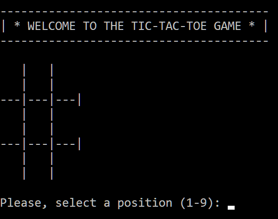
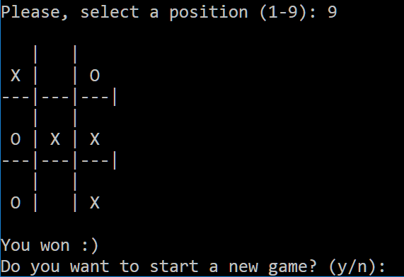

# Python Tic-tac-toe 🐍🎲💻
This repository contains a Python version of the popular Tic-tact-toe game, in which the player must connect three positions before the computer does it.

It was developped during the course [Python Bootcamp 2020 Build 15 working Applications and Games](https://www.udemy.com/course/python-complete-bootcamp-2019-learn-by-applying-knowledge/). Please, check it for the original code.

